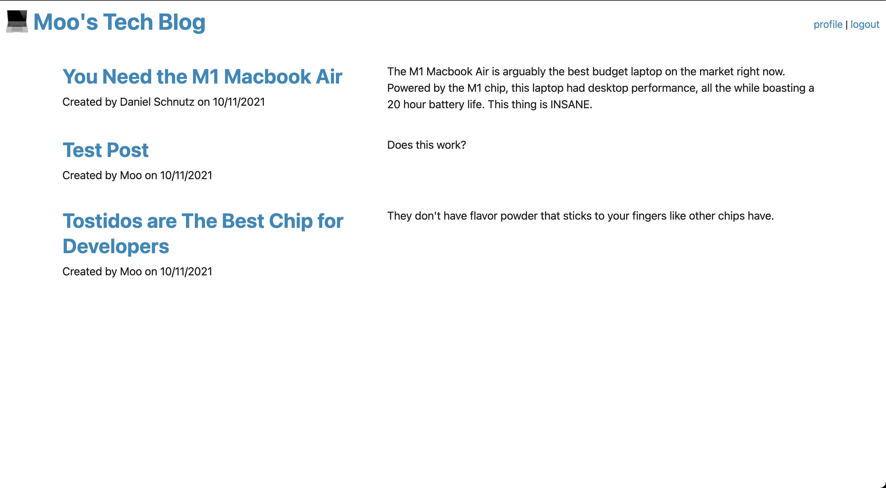
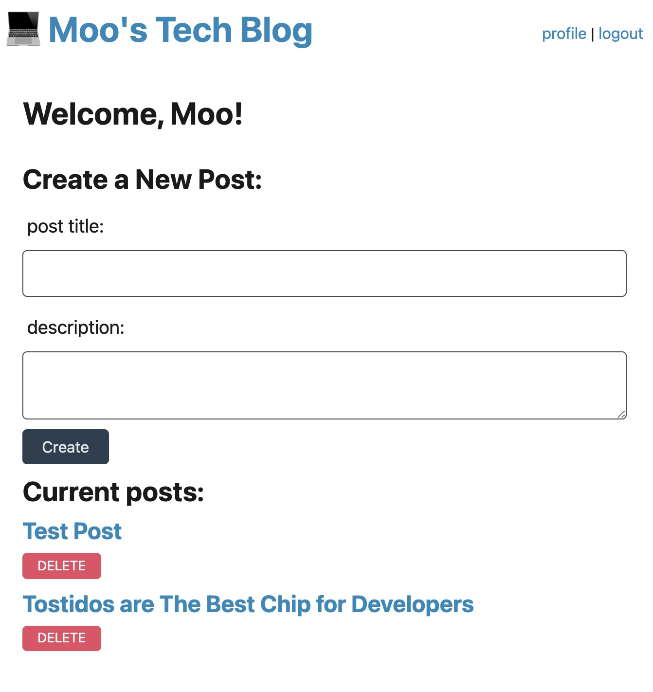
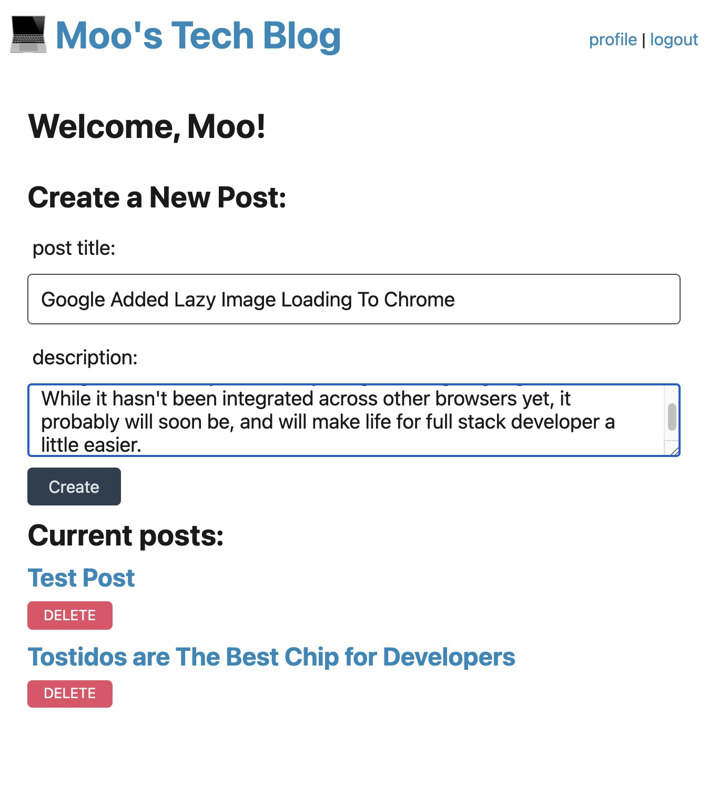
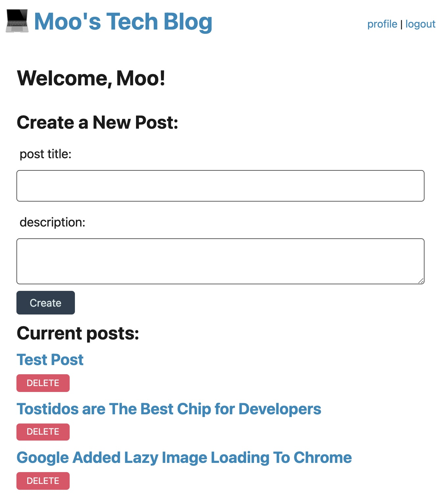
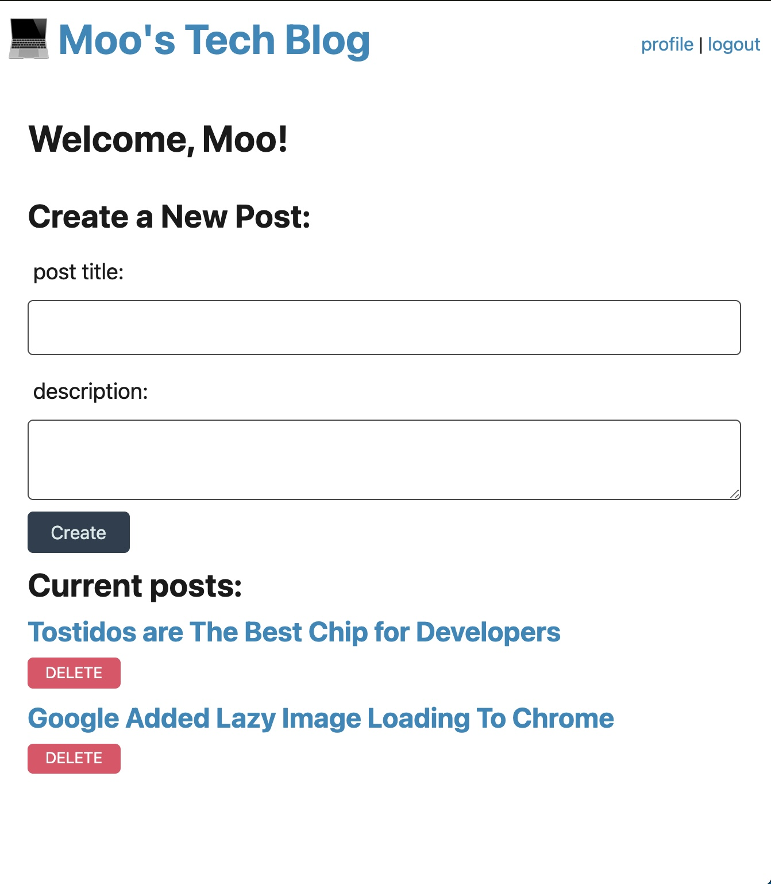

# moosTechBlog
Welcome to my Tech Blog!  This app serves as a proof of concept.  It was a means for me to learn how to handle login information in a secure manner, use cookies, and have users post and delete from a database.

I plan on posting the scripts to tech based videos here, feel free to make your own account on the heroku deployment and post to the blog.

## Table of Contents

- [How To Run](#how-to-run)
- [The Demo](#the-demo)
- [About Me](#about-me)
- [Future Development](#future-development)
- [Built With](#built-with)

### How To Run
After forking the repository, you want to make sure node is installed on your device.
1. Within the terminal for the repo you want to run an npm install.
```
npm install
```
2. You then want to set up your .env file with the correct credentials.
3. Open mysql and make the source schema.sql within the db folder.
4. Run an npm run seed command to seed the databases.
```
npm run seed
```
5. Start the server using the npm start command.
```
npm start
```
6. Go to the browser and use the app.

### The Demo

Below is a link to the deployed application (deployed via heroku).


Below is a link to a youtube video of the application in action.


Below are a few screenshots of the functionality of the app.

### Homepage



### Responsive Scaling


### Profile Page



### Making A New Post



### New Post Being Added to Profile Page



### Deleting an old Post




### About Me
This app was created by Muhaimen Ahmed. You can find me at github.com/mellowmoo .  Thank you for checking it out.

Special thanks for those who helped me when I got stuck on certain parts of development.

### Future Development
I would like to add the following features.

- the option to post photos
- lossless image compresson of photos submitted by users for optimization
- administrator accounts so the blog can be moderated
- ability for users to submit links with their posts
- the ability to edit past posts
- the ability for users to comment on other members posts
- user profile pictures w/ a default placeholder image for those who do not upload avatars.

If you would like to submit improvements, feel free to reach out.  If you would like to collaborate, please reach out as well.  I have much to learn and working with others is a great way to get new perspectives on things.

### Built With

* [HTML](https://developer.mozilla.org/en-US/docs/Web/HTML)

* [CSS](https://developer.mozilla.org/en-US/docs/Web/CSS)

* [Javascript](https://developer.mozilla.org/en-US/docs/Web/JavaScript)

* [jQuery](https://developer.mozilla.org/en-US/docs/Glossary/jQuery)

* [Node.js / Express](https://developer.mozilla.org/en-US/docs/Learn/Server-side/Express_Nodejs)

* [Bootstrap](https://getbootstrap.com/docs/4.4/getting-started/introduction/)

* [Handlebars](https://handlebarsjs.com/guide/#what-is-handlebars)